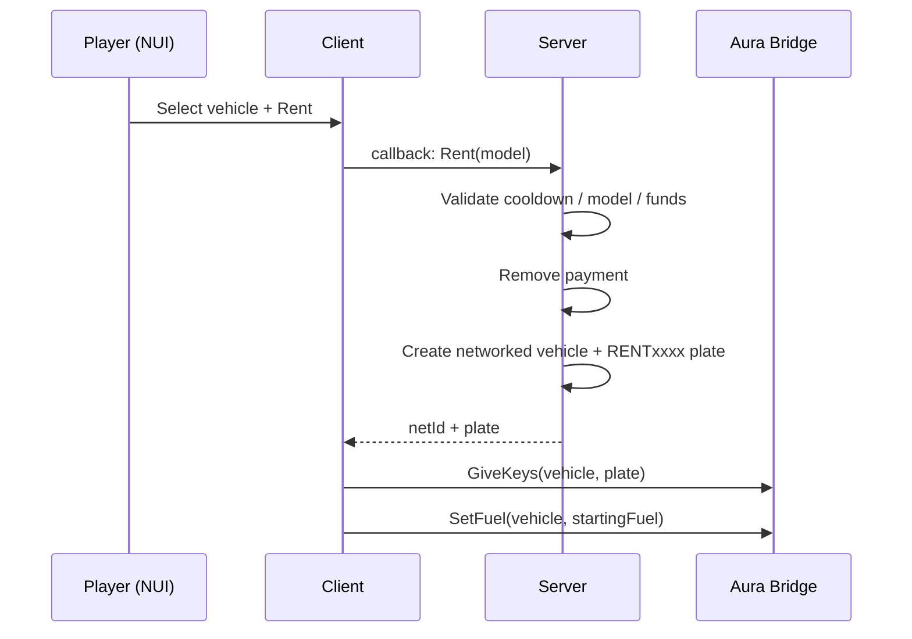

# aura\_rentvehicle

**aura\_rentvehicle** is a drop-in vehicle rental script for FiveM. Players walk up to a rental NPC, browse a catalog of vehicles with live stats and pricing in a clean NUI, and rent a car on the spot whilst plates, keys and fuel are handled automatically.

It runs out of the box on **ESX**, **QBCore** and **qbx\_core** without touching a single framework export.

***

### Features

| Feature                 | Description                                                                                           |
| ----------------------- | ----------------------------------------------------------------------------------------------------- |
| Multi-framework         | ESX / QBCore / QBX via Aura Bridge auto-detection                                                     |
| Server-authoritative    | Payment validation, spawning, ownership checks and refunds are enforced server-side                   |
| NUI vehicle catalog     | UI displays speed, seats, braking, acceleration, class labels and preview images                      |
| Automatic keys & fuel   | Plates are applied to the spawned vehicle; keys are handed out through the bridge's VehicleKey module |
| Return points & refunds | Drive into a return zone, press one key, get refunded by configurable percentage                      |
| Fully configurable      | Cooldowns, payment account, plate prefix, refund %, blips, keybind, starting fuel and more            |

### Requirements

* FiveM server build **≥ 7290** with **OneSync**
* [ox\_lib](https://github.com/overextended/ox_lib)
* [oxmysql](https://github.com/overextended/oxmysql)
* [aura\_bridge](https://github.com/auradevelopment-tebex/aura_bridge)


All dependencies are auto-detected through Aura Bridge, you never configure frameworks or inventories directly.


***

### Installation

#### 1. Download

1. Purchase the resource on our [Tebex store](https://store.auradevelopment.xyz) ( For Free )
2. Open the [Cfx.re Portal](https://portal.cfx.re/assets/granted-assets) portal
3. Navigate to **Granted Assets**
4. Download **aura\_rentvehicle** from your granted assets list


The download ships with a pre-built interface, extract it and you are ready to go.


#### 2. Place it on your server

```
resources/
└── [scripts]/
    └── aura_rentvehicle/
```

#### 3. Ensure dependencies first

The manifest declares its dependencies, but an explicit load order in your `server.cfg` is safest:

```bash
ensure oxmysql
ensure ox_lib
ensure aura_bridge
ensure aura_rentvehicle
```


If `aura_bridge` is not started before this resource, its exports will be missing and the resource will fail to start.


#### 4. Verify

1. Restart the server (or `refresh` + `ensure aura_rentvehicle`).
2. Walk to a rental NPC
3. Use the target interaction **"Rent a Vehicle"** to open the catalog.


Seeing the catalog with prices and stats means everything is wired up correctly.


***

### Configuration

Everything lives in one file:

```
configs/shared/main.lua
```

#### Core options

| Option              | Type    | Default               | Description                                                                 |
| ------------------- | ------- | --------------------- | --------------------------------------------------------------------------- |
| `debug`             | boolean | `false`               | Enables colored debug prints on client and server                           |
| `rentCooldown`      | number  | `30`                  | Seconds a player must wait after renting before renting again               |
| `paymentAccount`    | string  | `'bank'`              | Account charged on rent and refunded on return (`'bank'` or `'cash'`)       |
| `platePrefix`       | string  | `'RENT'`              | Rental plate prefix, combined with 4 random digits (GTA plates max 8 chars) |
| `spawnSearchRadius` | number  | `100.0`               | Max distance from a location for its spawn points to be used                |
| `spawnSlotRadius`   | number  | `5.0`                 | Radius in which a vehicle counts as occupying a spawn slot                  |
| `startingFuel`      | number  | `100`                 | Fuel level applied to freshly rented vehicles (0–100)                       |
| `refundPercent`     | number  | `100`                 | Percentage of the rental price refunded on return (0–100)                   |
| `returnKeybind`     | string  | `'E'`                 | Default return keybind at return points (players can rebind it)             |
| `pedModel`          | string  | `'a_m_m_prolhost_01'` | Ped model used for every rental NPC                                         |
| `vehicleImageBase`  | string  | fivem-docs CDN        | Base URL for preview images: `<base><name>.webp`                            |


**Refunds are flat.** With `refundPercent = 80`, returning any vehicle refunds exactly 80% of its configured price, vehicle condition does not affect it.


#### Blip settings

Draws a map blip at each rental NPC:

```lua
blip = {
    enabled = true,                -- draw blips on the map
    sprite  = 467,                 -- GTA blip sprite id
    color   = 9,                   -- GTA blip color id
    scale   = 0.6,                 -- blip scale
    label   = 'Vehicle Rental',    -- blip name
},
```

#### Economy presets



Players get everything back on return:

```lua
refundPercent = 100,
```



Keep 15% as a rental fee:

```lua
refundPercent = 85,
```



Charge cash instead of bank:

```lua
paymentAccount = 'cash',
```



***

### Locations & Vehicles

#### Adding a location

Each entry in `locations` defines one rental site: the NPC position, a return zone and the parking spots vehicles spawn on.

```lua
{ -- My new location
    ped = vec4(x, y, z, heading),          -- rental NPC

    returnPoint = {
        pos    = vec4(x, y, z, heading),   -- center of the return zone
        radius = 10.0,                     -- zone radius in units
    },

    spawnPoints = {                        -- rented vehicles spawn here
        vec4(x, y, z, heading),
        vec4(x, y, z, heading),
    },
},
```

| Field                         | Description                                                                                |
| ----------------------------- | ------------------------------------------------------------------------------------------ |
| `ped`                         | Where the rental NPC stands. Also drives the blip and target interaction                   |
| `returnPoint.pos` / `.radius` | Players must sit **inside this radius** in their rental to return it                       |
| `spawnPoints[]`               | Free spots are picked top-down; a spot is skipped if a vehicle is within `spawnSlotRadius` |


Use accurate ground Z coordinates for peds and spawn points so they dont end up floating.


#### Default locations

Six sites ship by default: LS City centre, Sandy Shores, Grapeseed, Paleto Bay, City (Hospital) and Airport.

#### Adding vehicles

Vehicle entries use GTA model names as keys. The `name` field must match the model name because it builds the preview image URL (`<vehicleImageBase><name>.webp`).

```lua
vehicles = {
    [`sultan`]   = { label = 'Sultan',   name = 'sultan',   price = 6000 },
    [`baller`]   = { label = 'Baller',   name = 'baller',   price = 8000 },
    [`coquette`] = { label = 'Coquette', name = 'coquette', price = 25000 },
},
```

Twenty vanilla vehicles ship by default, ranging from the Panto ($2,000) to the 9F ($32,000).


Addon vehicles work too just make sure the model streams before the catalog opens so stats can be read, and host the preview image on your own CDN via `vehicleImageBase`.


***

### Usage

#### Renting a vehicle

1. Approach a rental NPC and use **Rent a Vehicle** (target interaction).
2. Browse the catalog: every card shows price, class, top speed, seats, braking and acceleration.
3. Press **Rent**. The server validates everything, charges `paymentAccount`, spawns the car on a free spawn point and warps you in.
4. You receive keys automatically for the generated plate (`RENTxxxx`), and the tank is filled to `startingFuel`.




Rentals are rate-limited by `rentCooldown`, and each active rental gets a collision-checked unique plate.


If anything fails, insufficient funds, cooldown, full parking, you get an error notification explaining why, and the catalog button shows an X state.

#### Returning a vehicle

1. Drive your rented car into any **return zone** of a rental location.
2. A prompt appears: _Return vehicle — press \[E]_ (or your rebound key).
3. Press the key. The server verifies you are inside a zone **and** own the rental, refunds `price × refundPercent` to your account, and deletes the vehicle.

The return prompt only appears while you are sitting in **your own** rental, matching is done by plate, so it works identically on every framework.


Returns outside a return zone are rejected server-side. The keybind does nothing unless you are parked inside the zone with the rental.


***

### Developer Reference

#### File structure

```
aura_rentvehicle/
├── fxmanifest.lua            # manifest, load order, dependencies
├── configs/shared/main.lua   # single shared config
├── client/_index.lua         # module loader
├── client/main.lua           # NUI, targeting, zones, keybinds
├── server/_index.lua         # module loader
├── server/main.lua           # rent/return logic, rentals table
├── shared/debug.lua          # debugPrint helper
├── web/                      # UI
│   └── build/
```

#### Server callback

**`aura_rentvehicle:server:Rent`**

Registered with `lib.callback.register` , call it with `lib.callback.await`.

| Argument     | Type               | Description                |
| ------------ | ------------------ | -------------------------- |
| `data.model` | `string \| number` | Key from `Config.vehicles` |

**Returns** a table:

| Field     | Type      | Description                                         |
| --------- | --------- | --------------------------------------------------- |
| `success` | boolean   | Whether the rental succeeded                        |
| `error`   | `string?` | Failure reason (localized message shown to players) |
| `netId`   | `number?` | Network ID of the spawned vehicle                   |
| `plate`   | `string?` | Generated rental plate                              |

```lua
local response = lib.callback.await('aura_rentvehicle:server:Rent', false, { model = 'sultan' })
if response.success then
    print('Spawned with plate:', response.plate)
end
```

#### Events

| Event                            | Direction       | Payload                        | Purpose                                                 |
| -------------------------------- | --------------- | ------------------------------ | ------------------------------------------------------- |
| `aura_rentvehicle:client:notify` | server → client | `{ type, title, description }` | Return/refund notification                              |
| `aura_rentvehicle:server:Return` | client → server | —                              | Return request (zone + ownership validated server-side) |

#### Statebags

Other resources can identify rentals through entity state:

```lua
local state = Entity(vehicle).state

state.rented        -- player identifier of the renter (server-side value)
state.rentedPlate   -- rental plate, e.g. 'RENT4821'
state.fuel          -- replicated fuel level
```

#### NUI callbacks

| Callback           | Responds with                         | Purpose                                     |
| ------------------ | ------------------------------------- | ------------------------------------------- |
| `getVehicles`      | `Vehicle[]`                           | Catalog data incl. computed stats per model |
| `aura_rentvehicle` | `{ success, error?, netId?, plate? }` | Rent attempt                                |
| `close`            | `'ok'`                                | Close the interface                         |

#### Integration examples



```lua
local function IsRental(vehicle)
    return Entity(vehicle).state.rentedPlate ~= nil
end
```



```lua
AddEventHandler('impound:checkVehicle', function(vehicle, cb)
    cb(Entity(vehicle).state.rented == nil)
end)
```



```lua
-- The rentals table is keyed by netId:
-- rentals[netId] = { entity, owner, plate }
```



***

### Troubleshooting

<details>

<summary>The rental NPC doesn't appear</summary>

Make sure `aura_bridge` is started **before** this resource, and that the ped model in `Config.pedModel` is valid. Enable `debug = true` , the client will log whether peds spawned via the bridge utility or fell back to native creation.

</details>

<details>

<summary>I get "No spawn point available — the parking is full"</summary>

Every spawn point within `spawnSearchRadius` has a vehicle within `spawnSlotRadius` of it. Add more `spawnPoints` to the location or reduce `spawnSlotRadius`.

</details>

<details>

<summary>Keys don't work on the rental</summary>

Confirm your vehicle key resource is supported by Aura Bridge (qb-vehiclekeys, qbx\_vehiclekeys, wasabi\_carlock, renewed-vehiclekeys and more). The script registers keys under the exact generated plate after taking network control, if a custom key system reads plates differently, extend its bridge adapter.

</details>

<details>

<summary>Preview images are broken</summary>

Images load from `vehicleImageBase .. name .. '.webp'`. The default CDN only covers vanilla vehicles, point `vehicleImageBase` at your own host for addons.

</details>

<details>

<summary>The return prompt never shows</summary>

You must be driving the rental itself (matched by `rentedPlate`) and physically inside the location's `returnPoint.radius`. If you restarted the resource mid-session, re-rent to refresh the entity statebags.

</details>

<details>

<summary>Rent fails silently with "Server error"</summary>

Enable `debug = true` and check the server console. The most common cause is `aura_bridge` not being started first.

</details>

***

### Links

* [Tebex Store](https://store.auradevelopment.xyz)
* [Discord](https://discord.gg/aApEr7KTsp)

